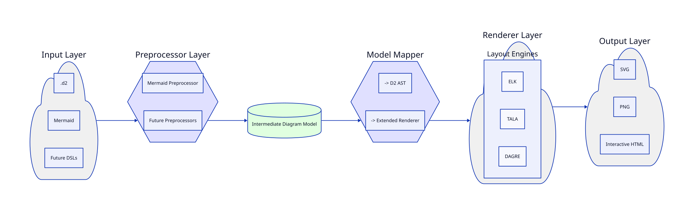

# Drift

**Tagline:** Deterministic, Air-Gap-Ready Flowcharts-as-Code

Drift is a powerful engine that transforms D2 and Mermaid flowchart definitions into beautiful, consistent SVG diagrams. Designed for security-conscious environments, Drift is fully air-gapped, requiring no network access at build time. It offers both a command-line interface (CLI) for local use and a WebAssembly (WASM) module for seamless browser integration.

**NOTE:** Due to limitations in the current environment, the D2 dependency has not been vendored. To make this project fully air-gap ready, you will need to manually vendor the D2 source code into the `third_party/d2` directory.

## Key Features

-   **Deterministic Rendering:** Get the exact same SVG every time from a given input.
-   **Air-Gap Ready:** All dependencies are vendored, and no network calls are made during builds.
-   **Mermaid Compatibility:** Parse Mermaid flowchart syntax (`graph TD/LR/BT/RL`) and render it as a D2 diagram.
-   **Dynamic Layout Engine:** Choose between DAGRE, TALA, or ELK layout engines at runtime for optimal diagram rendering.
-   **CLI & WASM Support:** Use Drift locally from your terminal or integrate it directly into your web applications.
-   **Open Source:** MIT Licensed and community-driven.

## Usage

### CLI

To render a local diagram file:

```bash
drift render my-diagram.d2 --output my-diagram.svg
drift render my-flowchart.mermaid --output my-flowchart.svg --engine ELK
```

### Browser (WASM)

```javascript
import drift from 'drift-wasm';

const mermaidSyntax = `
graph TD;
    A-->B;
    A-->C;
    B-->D;
    C-->D;
`;

const svgOutput = drift.render(mermaidSyntax);
document.getElementById('diagram-container').innerHTML = svgOutput;
```

## Architecture

Drift's architecture is designed for simplicity and modularity. The core components include:

-   **Preprocessor:** A parser that converts Mermaid syntax into a D2 Abstract Syntax Tree (AST).
-   **Renderer:** A module that takes a D2 AST, selects a layout engine, and generates an SVG.
-   **CLI:** A command-line interface for rendering diagrams from local files.
-   **WASM:** A WebAssembly module that exposes Drift's rendering capabilities to the browser.



## Directory Structure

```
drift/
├── LICENSE
├── README.md
├── go.mod
├── go.sum
├── third_party/d2/
├── cmd/drift/main.go
├── pkg/preprocessor/parser.go
├── pkg/renderer/renderer.go
├── wasm/drift_wasm.go
├── wasm/build.sh
└── docs/
    ├── architecture.d2
    └── architecture.svg
```

## Architecture Decision Records (ADRs)

-   [ADR-0001: Air-Gap Readiness](./docs/0001-air-gap.md)
-   [ADR-0002: Dynamic Layout Engine Selection](./docs/0002-dynamic-layout-engine.md)
-   [ADR-0003: Mermaid Compatibility Strategy](./docs/0003-mermaid-compatibility.md)
-   [ADR-0004: Browser and WASM Support](./docs/0004-browser-wasm.md)
-   [ADR-0005: Timeline-Aware Diagrams (Future)](./docs/0005-timeline-awareness.md)

## Contributing

Contributions are welcome! Please open an issue or submit a pull request.
